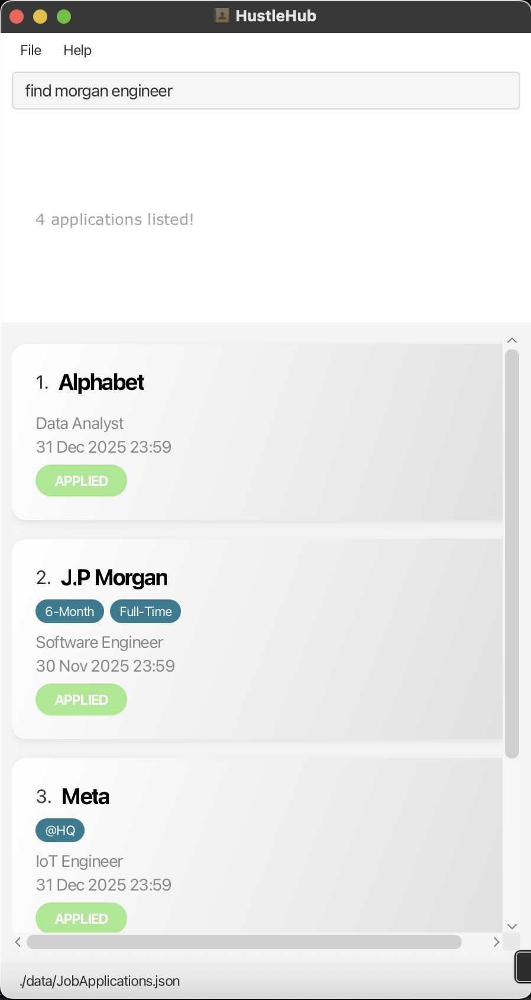
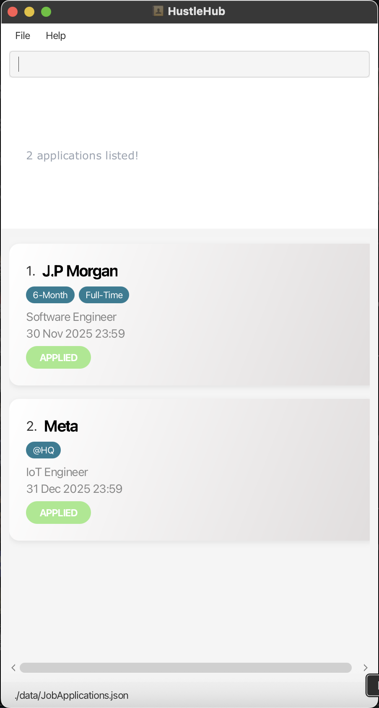
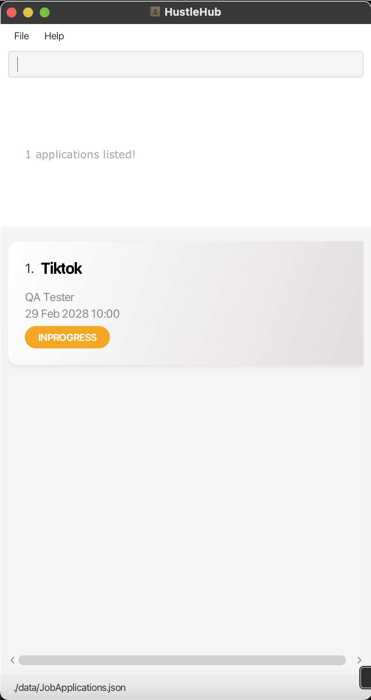
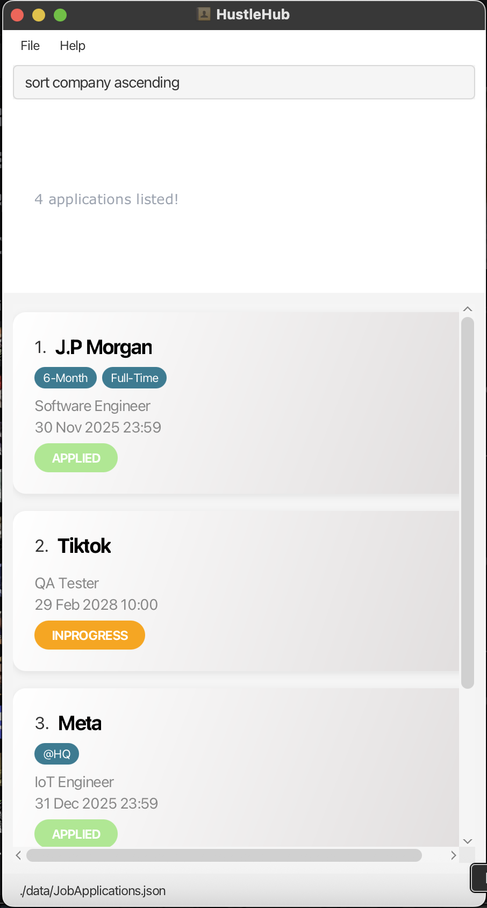
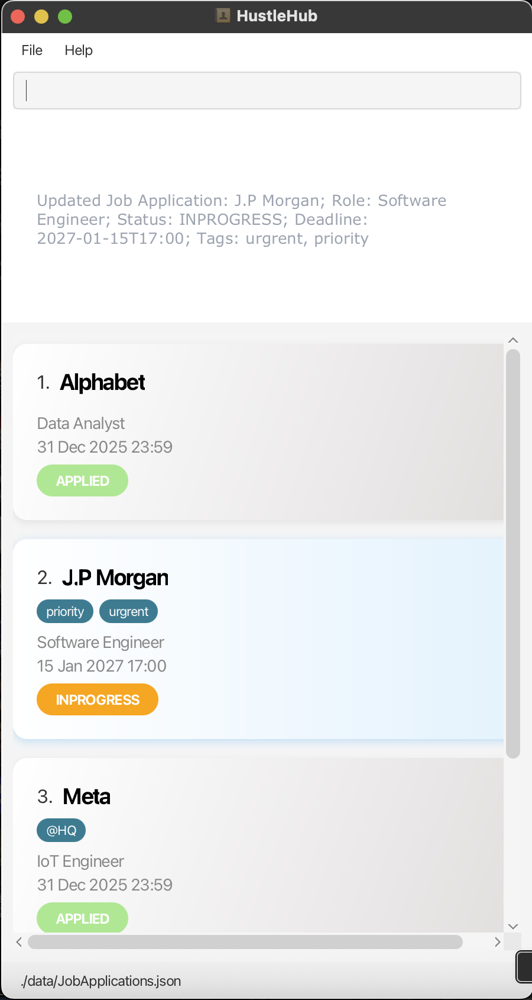
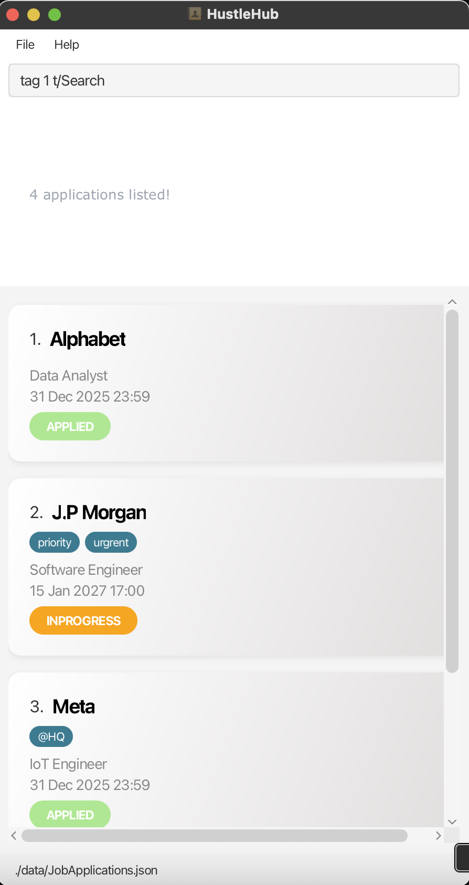
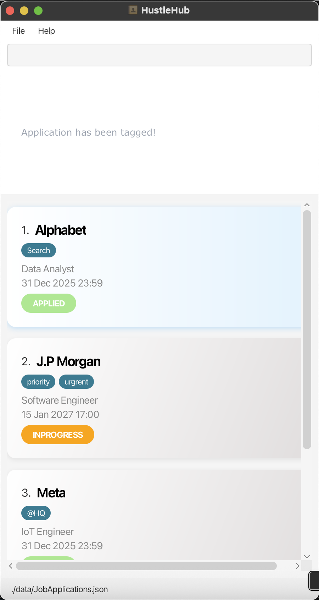
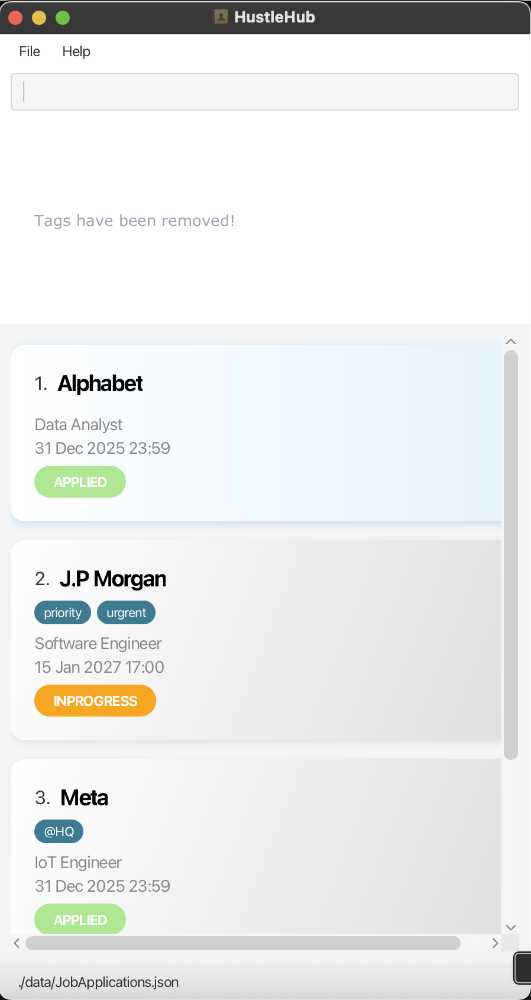

## Who Should Use HustleHub?

**Ideal for:**
- Computing students applying to 15+ positions simultaneously
- Users comfortable with command-line interfaces (CLI)
- Those who prefer keyboard-driven workflows over mouse clicking
- Anyone tracking applications with multiple status changes and deadlines

**Not ideal for:**
- Managing fewer than 5 applications (spreadsheet is simpler)
- Users unfamiliar with CLI syntax
- Teams needing collaborative features
- Users requiring visual calendar integrations

**Why HustleHub over alternatives?**
HustleHub combines CLI speed with visual overview, letting you update 5 applications in under 30 seconds - much faster than spreadsheets or web apps for heavy users.

---

* Table of Contents
{:toc}

--------------------------------------------------------------------------------------------------------------------

## Quick start

1. Ensure you have Java `17` or above installed in your Computer.<br>
   **Mac users:** Ensure you have Java `17` JDK version prescribed [here](https://se-education.org/guides/tutorials/javaInstallationMac.html).

1. Download the latest `.jar` file from this repository's [Releases](https://github.com/AY2526S1-CS2103T-T11-1/tp/releases) page.

1. Copy the file to the folder you want to use as the _home folder_ for HustleHub.

1. Open a command terminal, `cd` into the folder you put the jar file in, and run `java -jar <downloaded-jar-name>.jar` to start the application.<br>
   A GUI similar to the below should appear in a few seconds. Note how the app contains some sample data.<br>
   

1. Type the command in the command box and press Enter to execute it. e.g. typing **`help`** and pressing Enter will open the help window.<br>
   Some example commands you can try:

   * `list` : Lists all applications.

   * `add n/Microsoft r/Cloud engineer s/INPROGRESS d/2025-10-31T23:59` : Adds an application for `Microsoft` to HustleHub. (See [date format](#features))

   * `delete 3` : Deletes the 3rd application shown in the current list.

   * `update 1 s/INPROGRESS d/2027-01-15T17:00` : Updates the 1st application's status and deadline.

   * `sort deadline` : Sorts the applications by **deadline** (ascending by default). You can also sort by `company` or `role`, and use `desc`. e.g. `sort company desc`

   * `exit` : Exits the app.

1. Refer to the [Features](#features) below for details of each command.

--------------------------------------------------------------------------------------------------------------------

## Understanding HustleHub

Before diving into commands, let's understand the core concepts of HustleHub.

### Application Structure

Every job application in HustleHub contains the following information:

```
┌─────────────────────────────────────────────────────┐
│           Job Application Entry                     │
├─────────────────────────────────────────────────────┤
│ Company Name: Microsoft              [Required]     │
│ Role: Cloud Engineer                 [Required]     │
│ Status: INPROGRESS                   [Required]     │
│ Deadline: 2025-10-31T23:59           [Required]     │
│ Tags: remote, urgent, priority       [Optional]     │
│      (maximum 3 tags)                               │
└─────────────────────────────────────────────────────┘
```

**Key Points:**
- All fields except tags are **required** when adding an application
- **Company + Role** combination must be unique (no duplicates)
- **Tags** are optional and limited to 3 per application (max 30 characters each)
- **Deadline** must be a future date and time

### Status Lifecycle

Applications progress through three distinct stages:

```
   APPLIED ────────→ INPROGRESS ────────→ REJECTED
   (Submitted)       (Active Process)      (Closed)
      │                    │                   │
      │                    │                   │
   After you          During interviews,    After receiving
   click "Apply"      assessments, or       rejection
                      waiting for response
```

**Important Notes:**
- Status changes are **manual** - update them as your application progresses
- These are the ONLY valid values; custom statuses are not supported
- Status values are **case-insensitive** in commands: `applied` = `APPLIED`
- Use **tags** for more detailed tracking (e.g., `t/phone-screen`, `t/final-round`)
- Applications remain in your records even after rejection for future reference

### Filter vs. Find vs. Sort

Understanding the difference between these three operations:

```
┌─────────────────────────────────────────────────────────────┐
│ FILTER: Narrow down by exact property match                 │
│ ----------------------------------------------------------- │
│ [10 apps] ──filter s/APPLIED──> [3 apps with APPLIED]       │
│                                                             │
│ • Hides non-matching applications                           │
│ • Searches one field at a time (status, company, etc.)      │
│ • Exact match for status/deadline, partial for text         │
└─────────────────────────────────────────────────────────────┘

┌─────────────────────────────────────────────────────────────┐
│ FIND: Search across company name AND role                   │
│ ----------------------------------------------------------- │
│ [10 apps] ──find Google engineer──> [4 matching apps]       │
│                                                             │
│ • Hides non-matching applications                           │
│ • Searches BOTH company name and role simultaneously        │
│ • Partial keyword matching (case-insensitive)               │
└─────────────────────────────────────────────────────────────┘

┌─────────────────────────────────────────────────────────────┐
│ SORT: Reorder applications (no hiding)                      │
│ ----------------------------------------------------------- │
│ [A, Z, M, B] ──sort company──> [A, B, M, Z]                 │
│                                                             │
│ • Shows ALL applications, just reordered                    │
│ • Available fields: company, role, deadline                 │
│ • Ascending (asc) or descending (desc)                      │
└─────────────────────────────────────────────────────────────┘
```

**Quick Decision Guide:**

| I want to... | Use this command | Example |
|-------------|------------------|---------|
| See only applications with a specific status | `filter` | `filter s/APPLIED` |
| See only applications due on a date | `filter` | `filter d/2025-12-31` |
| Search for a company or role name | `find` | `find Google` or `find engineer` |
| Organize by deadline or alphabetically | `sort` | `sort deadline` or `sort company` |
| Reset and see everything | `filter none` or `list` | `filter none` or `list`|

--------------------------------------------------------------------------------------------------------------------

## Common Workflows

Now that you understand the core concepts, here are practical scenarios showing how to combine commands effectively.

### Scenario 1: Weekly Deadline Check
**Goal:** Review upcoming deadlines and prioritize urgent applications

1. `sort deadline` — See applications by earliest deadline
2. Review the top 5 results to identify time-sensitive applications
3. `tag 1 t/urgent` — Mark the most urgent application
4. `tag 2 t/urgent` — Mark the second urgent application
5. `filter t/urgent` — Focus view on only urgent applications

**Why this works:** Sorting by deadline surfaces what needs attention first, tagging creates a reusable category, and filtering lets you focus exclusively on what matters this week.

### Scenario 2: After Receiving Interview Invitation
**Goal:** Update application status and add preparation notes

1. `find Stripe` — Quickly locate the company (avoid scrolling through full list)
2. Note the index shown (e.g., application appears as #3)
3. `update 3 s/INPROGRESS` — Change status from APPLIED to INPROGRESS
4. `tag 3 t/system-design t/behavioral-prep` — Add interview preparation tags

**Why this works:** `find` is faster than manual searching, `update` changes the status in one command, and tags help you track what interview prep is needed.

### Scenario 3: End-of-Month Cleanup
**Goal:** Remove old rejected applications to keep your list focused

1. `filter s/REJECTED` — View only rejected applications
2. Review deadlines to identify outdated entries (e.g., rejections from 3+ months ago)
3. `delete 1` — Remove the first result
4. `delete 1` — Remove the next (which is now first after previous deletion)
5. `list` — Return to viewing all applications

**Why this works:** Filtering isolates what you want to clean up, repeated `delete 1` removes items efficiently as the list re-indexes, and `list` clears the filter to return to normal view.

### Scenario 4: Comparing Similar Roles
**Goal:** Find and compare backend engineer positions across companies

1. `find backend` — Search for applications with "backend" in company name or role
2. `sort deadline` — Order by application deadline (earliest first)
3. Review side-by-side: company names, deadlines, and existing tags
4. `tag 2 t/top-choice` — Mark your preferred option among the results
5. `tag 5 t/backup` — Tag a safe backup option

**Why this works:** `find` searches both company and role fields to locate backend positions, deadline sorting shows urgency, and tags help you categorize your preferences within the search results.

### Scenario 5: Preparing for Career Fair
**Goal:** Add multiple new applications quickly after a career fair

1. `add n/Meta r/Software Engineer s/APPLIED d/2025-11-15T23:59` — Add first company
2. `add n/Netflix r/Backend Engineer s/APPLIED d/2025-11-20T23:59 t/career-fair` — Add second with tag
3. `add n/Salesforce r/Cloud Engineer s/APPLIED d/2025-11-18T23:59 t/career-fair` — Add third
4. `filter t/career-fair` — View all applications from this event
5. `sort deadline` — Prioritize by earliest deadline

**Why this works:** Batch adding with a consistent tag (`t/career-fair`) lets you track applications from the same source, filtering by that tag groups them together, and sorting helps you tackle applications strategically.

### Scenario 6: Following Up on Pending Applications
**Goal:** Identify applications with no response for 2+ weeks

1. `filter s/APPLIED` — Show applications still in "applied" status
2. `sort deadline asc` — Order by deadline (earliest first)
3. Review companies where deadline is approaching but status hasn't changed
4. `tag 3 t/follow-up` — Mark applications that need a status check email
5. `filter t/follow-up` — Focus on applications requiring action

**Why this works:** Status filtering finds stagnant applications, deadline sorting reveals time pressure, tags create an actionable todo list, and re-filtering keeps you focused on follow-up tasks.

### Scenario 7: Filtering and Deleting Rejected Applications
**Goal:** Clean up rejected applications while understanding how deletion works with filtered views

**The Situation:** You have 10 total applications. Several were rejected, and you want to remove them to keep your list focused.

**Important:** ⚠️ Index numbers change when you filter - they always reflect what's currently visible!

**Step-by-step:**

1. `filter s/REJECTED` — Shows only rejected applications (let's say 4 results appear)
2. Review the filtered list - applications are now numbered 1, 2, 3, 4 in the display
3. `delete 1` — Deletes the **first application in the filtered view**
4. The list updates - remaining rejections are now numbered 1, 2, 3
5. `delete 1` — Deletes what is now the first visible application
6. `list` — Returns to full view (now shows 8 total applications)

**Why this matters:**
- **Index numbers always reflect your CURRENT view**, not the original full list
- After filtering, indices restart from 1 for visible results only
- `delete 1` always deletes the **first VISIBLE application**, regardless of its original position
- Same principle applies to `update`, `tag`, and `untag` commands

**Visual Example:**
```
Full list (10 apps):          After filter s/REJECTED:     After delete 1:
1. Google | APPLIED           1. Meta | REJECTED           1. Apple | REJECTED
2. Meta | REJECTED            2. Apple | REJECTED          2. Netflix | REJECTED
3. Amazon | APPLIED           3. Netflix | REJECTED        3. Stripe | REJECTED
4. Apple | REJECTED           4. Stripe | REJECTED         
5. Tesla | INPROGRESS         (only 4 visible)             (only 3 visible)
6. Netflix | REJECTED
7. Uber | APPLIED
8. Stripe | REJECTED
9. Airbnb | INPROGRESS
10. Lyft | APPLIED
```

**Key Takeaway:** When working with filtered views, always use the index numbers you see in the current display. If unsure, run `list` first to see the unfiltered view.

--------------------------------------------------------------------------------------------------------------------

## Command summary

### General Commands

| Command                                      | Description                                  | Format |
|----------------------------------------------|----------------------------------------------|--------|
| [**exit**](#exiting-the-program--exit)       | Exits the program                            | `exit` |
| [**help**](#viewing-help--help)              | Displays how to use all commands in a window | `help` |
| [**list**](#listing-all-applications--list)  | Lists all applications                       | `list` |

### Application Management

| Command                                          | Description                                      | Format                                                                     |
|--------------------------------------------------|--------------------------------------------------|----------------------------------------------------------------------------|
| [**add**](#adding-a-job-application-add)         | Adds a job application to HustleHub              | `add n/COMPANY_NAME r/ROLE s/STATUS d/DEADLINE [t/TAG]…​`                  |
| [**delete**](#deleting-an-application--delete)   | Deletes a job application given its index number | `delete INDEX`                                                             |
| [**find**](#finding-job-applications-find)       | Finds job applications by company name or role   | `find KEYWORD [MORE_KEYWORDS]`                                             |
| [**filter**](#filtering-job-applications-filter) | Filters job applications by a property           | `filter FLAG/KEYWORD`                                                      |
| [**sort**](#sorting-the-applications--sort)      | Sorts the job applications in HustleHub          | `sort FIELD`                                                               |
| [**update**](#updating-a-job-application-update) | Updates an existing job application's details    | `update INDEX [n/COMPANY_NAME] [r/ROLE] [s/STATUS] [d/DEADLINE] [t/TAG]…​` |

### Tag Management

| Command                           | Description                                   | Format                                  |
|-----------------------------------|-----------------------------------------------|-----------------------------------------|
| [**tag**](#adding-tags-tag)       | Adds new tags to a specified job application  | `tag JOB_APPLICATION_INDEX t/NEW_TAG`   |
| [**untag**](#removing-tags-untag) | Removes tags from a specified job application | `untag JOB_APPLICATION_INDEX t/NEW_TAG` |

--------------------------------------------------------------------------------------------------------------------

## Features

<div markdown="block" class="alert alert-info">

**:information_source: Notes about the command format:**<br>

* Words in `UPPER_CASE` are the parameters to be supplied by the user.<br>
  e.g. in `add n/NAME`, `NAME` is a parameter which can be used as `add n/John Doe`.

* Items in square brackets are optional.<br>
  e.g `n/NAME [t/TAG]` can be used as `n/John Doe t/friend` or as `n/John Doe`.

* Items with `…`​ after them can be used multiple times including zero times.<br>
  e.g. `[t/TAG]…​` can be used as ` ` (i.e. 0 times), `t/friend`, `t/friend t/family` etc.

* Parameters can be in any order.<br>
  e.g. if the command specifies `n/NAME p/PHONE_NUMBER`, `p/PHONE_NUMBER n/NAME` is also acceptable.

* Extraneous parameters for commands that do not take in parameters (such as `help`, `list`, `exit`) will be ignored.<br>
  e.g. if the command specifies `help 123`, it will be interpreted as `help`.

* If you are using a PDF version of this document, be careful when copying and pasting commands that span multiple lines as space characters surrounding line-breaks may be omitted when copied over to the application.

**Date & Time Formats in HustleHub**

*When adding/updating applications:*
- Format: `yyyy-MM-ddTHH:mm` (time required)
- Example: `2025-12-31T23:59`

*When filtering by deadline:*
- Format: `yyyy-MM-dd` (time not needed)
- Example: `2025-12-31`
- Matches all applications due on that date regardless of time

*Rules:*
- Must be future date (no past deadlines)
- Uses 24-hour format
- Minutes required even if `:00`
</div>

--------------------------------------------------------------------------------------------------------------------

## General Commands

### Exiting the program : `exit`

Exits the program.

Format: `exit`

<br>

[<u>Back to Command Summary</u>](#command-summary)

### Viewing help : `help`

Shows a message explaining how to access the help page.

Format: `help`

Result for `help`:


<br>

[<u>Back to Command Summary</u>](#command-summary)

### Listing all applications : `list`

Lists all job applications in HustleHub. This is useful after filtering to return to viewing all applications.

Format: `list`

<div markdown="span" class="alert alert-primary">:bulb: **Tip:**
`list` and `filter none` have the same effect - both show all applications.
</div>

<br>

[<u>Back to Command Summary</u>](#command-summary)

### Saving data

HustleHub data is automatically saved after any command that changes the data. There is no need to save manually.

### Editing the data file

HustleHub data is saved automatically as a JSON file `[JAR file location]/data/JobApplications.json`. Advanced users are welcome to update data directly by editing that data file.

<div markdown="span" class="alert alert-warning">:exclamation: **Caution:**
If your changes to the data file make its format invalid, HustleHub will discard all data and start with an empty data file at the next run. Hence, it is recommended to take a backup of the file before editing it.<br>
Furthermore, certain edits can cause HustleHub to behave in unexpected ways (e.g., if a value entered is outside of the acceptable range). Therefore, edit the data file only if you are confident that you can update it correctly.
</div>

---

## Application Management

### Adding a job application: `add`

Adds a job application to HustleHub.

Format: `add n/COMPANY_NAME r/ROLE s/STATUS d/DEADLINE [t/TAG]…​`

<div markdown="span" class="alert alert-primary">:bulb: **Tip:**
An application can have up to 3 tags.
</div>

Examples:
* `add n/Microsoft r/Cloud engineer s/INPROGRESS d/2025-10-31T23:59`
* `add n/Microsoft r/Cloud engineer s/INPROGRESS d/2025-10-31T23:59 t/Low-pay t/Good-boss`

<br>

[<u>Back to Command Summary</u>](#command-summary)

### Deleting an application : `delete`

Deletes the specified application from the application book.

Format: `delete INDEX`

* Deletes the application at the specified `INDEX`.
* The index refers to the index number shown in the displayed application list.
* The index **must be a positive integer** 1, 2, 3, …​

Examples:
* `list` followed by `delete 2` deletes the 2nd application in the application book.
* After filtering the list, `delete 1` deletes the 1st application in the currently displayed results.

<br>

[<u>Back to Command Summary</u>](#command-summary)

### Finding job applications: `find`

Finds job applications whose **Company Name** or **Role** matches any of the given keywords.

Format: `find KEYWORD [MORE_KEYWORDS]`

#### **Find Rules**

1. **Search Scope**: Searches both **Company Name** and **Role** fields.
   * An application is returned if either field contains at least one keyword.

2. **Case-Insensitive**: The search is case-insensitive.
   * `tiktok` matches "TikTok", "TikTok Inc", or "BigTikTok".

3. **Partial Matching**: Keywords match partial words.
   * `engineer` matches "Software Engineer", "Engineering Manager".

4. **Keyword Order**: The order of keywords does not matter.
   * `American Airlines` matches "Airlines American".

5. **OR Search**: Applications matching **at least one keyword** in **either field** are returned.
   * `find Morgan engineer` returns applications where:
     * Company contains "Morgan" (e.g., "J.P. Morgan"), OR
     * Role contains "engineer" (e.g., "Software Engineer"), OR
     * Both

#### **Examples**

* `find morgan`
  * Returns applications with company "Morgan Stanley" or "J.P. Morgan Chase".

* `find engineer`
  * Returns applications with roles like "Software Engineer", "Data Engineer", "Engineering Intern".

* `find Tiger America`
  * Returns "Tiger Management" (company), "Bank of America" (company), or any role containing "Tiger" or "America".

* `find backend google`
  * Returns applications where:
    * Company contains "Google", OR
    * Role contains "backend" (e.g., "Backend Developer"), OR
    * Both

Before: `find morgan engineer`



After: Returns all applications where company contains "morgan" OR role contains "engineer"



### Filtering Job Applications: `filter`

Filters the list of job applications based on a single field: **Tags**, **Status**, or **Application Deadline**.
* Filter command accepts only one filter flag at a time.

Format: `filter FLAG/KEYWORD`

or, to remove all filters: `filter none`


#### **Filtering Rules**


1. **Tags (`t/`)**: Matches if the `KEYWORD` is **contained** in any tag
   (e.g., `t/backend` matches a tag named "backend engineer").
    * The search is **case-insensitive**.


2. **Application Status (`s/`)**: Matches an exact, **case-insensitive** status.
    * Valid keywords are: **APPLIED**, **INPROGRESS**, or **REJECTED**.


3. **Application Deadline (`d/`)**: Matches the exact date only, ignoring the time component.
    * The date must be in the **`yyyy-MM-dd`** format (e.g., `2025-12-31`).
    * Matches all applications due on that date regardless of time

#### **Examples**

* `filter t/backend`
    * Returns applications with tags containing "backend" (e.g., "backend", "backend-dev").


* `filter s/applied`
    * Returns applications with the status "APPLIED".


* `filter d/2025-10-20`
    * Returns applications with an application deadline on October 20, 2025.


* `filter none`
    * Removes all current filters and shows the complete list of job applications.

Before: `filter s/inprogress`


      
After filtering: `INPROGRESS`



<br>

[<u>Back to Command Summary</u>](#command-summary)

### Sorting the applications : `sort`

Sorts the current list of applications by a chosen field, in ascending or descending order.

**Format:** `sort FIELD [ORDER]`
- **FIELD**: `company` \| `role` \| `deadline`
- **ORDER** (optional): `asc` \| `ascending` \| `desc` \| `descending` (default: `asc`)

**Notes:**
- Sorting is **stable** and **case-insensitive** for text fields (`company`, `role`).
- When sorting by **deadline**, missing/invalid deadlines appear **last** for `asc` (and **first** for `desc`).

**Examples:**
- `sort deadline`
- `sort company desc`
- `sort role ascending`

Before:


After:


<br>

[<u>Back to Command Summary</u>](#command-summary)

### Updating a job application: `update`

Updates the details of an existing job application in HustleHub.

Format: `update INDEX [n/COMPANY_NAME] [r/ROLE] [s/STATUS] [d/DEADLINE] [t/TAG]…​`

* Updates the job application at the specified `INDEX`.
* The index refers to the index number shown in the displayed application list.
* The index **must be a positive integer** 1, 2, 3, …​
* At least one of the optional fields must be provided.
* Existing values will be overwritten by the input values.
* When updating tags with `t/TAG`, all existing tags will be replaced by the new tags specified.
* You can remove all tags by typing `t/` without specifying any tags after it.

<div markdown="span" class="alert alert-warning">:exclamation: **Caution:**

* Deadline cannot be in the past. Please provide a future date and time in the format `yyyy-MM-ddTHH:mm`.
* Updating company name and/or role may result in duplicate applications if the combination already exists.
* Valid status values are: `APPLIED`, `INPROGRESS`, or `REJECTED` (case-insensitive).

</div>

**Examples:**

* `update 1 s/INPROGRESS` - Updates the status of the 1st application to INPROGRESS.
* `update 2 r/Senior Engineer d/2027-01-15T17:00` - Updates the role and deadline of the 2nd application.
* `update 3 n/Apple r/iOS Developer s/APPLIED d/2026-06-30T23:59 t/remote t/urgent` - Updates all fields of the 3rd application.
* `update 1 t/` - Removes all tags from the 1st application.

Before:


After updating with `update 2 s/INPROGRESS d/2027-01-15T17:00 t/priority t/urgent`:



<br>

[<u>Back to Command Summary</u>](#command-summary)

--------------------------------------------------------------------------------------------------------------------

## Tag Management

### Adding tags: `tag`

Adds tags to a job application.

Format: `tag JOB_APPLICATION_INDEX t/TAG...`

Input restrictions:
1. A `TAG` must be 1 to 30 characters long (cannot be blank).
2. A `TAG` is a single word (no spaces).
3. Each job application can have up to 3 tags.
4. Allowed characters: letters, digits, and at most 2 of the following special characters: `-`, `.`, `@`, `#`, `_`, `+`.

<div markdown="span" class="alert alert-primary">:bulb: **Tip:**
If you add a mix of duplicate and new tags, the new tags will be added whilst duplicates will be ignored.
</div>

**Example Tagging Strategies:**

**By priority:**
- `tag 1 t/first-choice t/dream-job`
- `tag 5 t/backup t/safe-option`

**By work arrangement:**
- `tag 2 t/remote t/flexible-hours`
- `tag 7 t/onsite t/relocation-required`

**By preparation needs:**
- `tag 3 t/leetcode-heavy t/system-design`
- `tag 4 t/C# t/Full-stack`

**By timeline:**
- `tag 1 t/fast-response t/rolling`
- `tag 6 t/late-deadline t/backup-plan`

Before:



After tagging:



<br>

[<u>Back to Command Summary</u>](#command-summary)

### Removing tags: `untag`

Removes tags from a job application.

Format: `untag JOB_APPLICATION_INDEX t/TAG...`

Input restrictions:
1. A `TAG` must be 1 to 30 characters long (cannot be blank).
2. A `TAG` is a single word (no spaces).
3. Allowed characters: letters, digits, and at most 2 of the following special characters: `-`, `.`, `@`, `#`, `_`, `+`.
4. Inputted tags must already exist on the application.

Examples:
- `untag 1 t/SQL`
- `untag 2 t/6-Month t/C++`
- `untag 3 t/python_v3.12 t/BlockChain t/Full-Stack`

Before:


After untagging:



<br>

[<u>Back to Command Summary</u>](#command-summary)

---

## Troubleshooting Common Errors

This section helps you resolve common errors you might encounter while using HustleHub.

### Command Format Errors

#### "Invalid command format!"
**Cause:** Missing required parameters or incorrect syntax.

**Solutions:**
- Ensure all required fields are provided with their prefixes (n/, r/, s/, d/)
- Check for typos in command names
- Verify prefixes are correct (use n/ not name/)
- Don't put text before the first prefix

**Examples:**
```
❌ add Microsoft Cloud Engineer APPLIED 2025-12-31T23:59
❌ add name/Microsoft role/Cloud Engineer
✅ add n/Microsoft r/Cloud Engineer s/APPLIED d/2025-12-31T23:59
```

---

### Date & Time Errors

#### "Invalid deadline format"
**Error Message:** `Invalid deadline format. Expected format: yyyy-MM-ddTHH:mm`

**Cause:** Incorrect date format or missing time component.

**Solutions:**
- Use format: `yyyy-MM-ddTHH:mm` (year-month-dayThour:minute)
- Include the uppercase 'T' separator between date and time
- Use 24-hour format (17:00, not 5:00 PM)
- Include minutes even if :00

**Examples:**
```
❌ add n/Google r/SWE s/APPLIED d/2025-12-31
   (missing time - must include T and time)

❌ add n/Google r/SWE s/APPLIED d/31-12-2025T23:59
   (wrong date order - must be year first)

❌ add n/Google r/SWE s/APPLIED d/2025/12/31T23:59
   (wrong separators - use hyphens not slashes)

❌ add n/Google r/SWE s/APPLIED d/2025-12-31 23:59
   (missing T separator)

✅ add n/Google r/SWE s/APPLIED d/2025-12-31T23:59
✅ update 1 d/2026-01-15T09:00
```

#### "Deadline cannot be in the past"
**Cause:** The date/time you provided has already passed.

**Solution:** Use a future date and time.

**Examples:**
```
❌ update 1 d/2020-01-01T00:00  (past date)
❌ add n/Meta r/SWE s/APPLIED d/2024-12-31T23:59  (already passed)
✅ update 1 d/2026-12-31T23:59  (future date)
```

---

### Status Errors

#### "Invalid status"
**Error Message:** `Invalid status. Valid values are: APPLIED, INPROGRESS, REJECTED`

**Cause:** Using a status value that doesn't exist in HustleHub.

**Solutions:**
- Only use these three values: `APPLIED`, `INPROGRESS`, or `REJECTED`
- Status is case-insensitive (applied = APPLIED)
- You cannot create custom statuses
- Use tags for more detailed tracking (e.g., t/interview, t/offer-received)

**Examples:**
```
❌ add n/Meta r/SWE s/PENDING d/2025-12-31T23:59
   (PENDING is not valid)

❌ add n/Meta r/SWE s/INTERVIEW d/2025-12-31T23:59
   (INTERVIEW is not valid - use INPROGRESS instead)

❌ add n/Meta r/SWE s/ACCEPTED d/2025-12-31T23:59
   (ACCEPTED is not valid)

✅ add n/Meta r/SWE s/APPLIED d/2025-12-31T23:59
✅ add n/Meta r/SWE s/inprogress d/2025-12-31T23:59  (case-insensitive)
✅ add n/Meta r/SWE s/INPROGRESS d/2025-12-31T23:59 t/phone-screen
   (use tags for detailed status)
```

---

### Tag Errors

#### "Cannot add tags: This application would exceed 3 tags"
**Cause:** Trying to add tags when the application already has 3 tags (the maximum allowed).

**Solutions:**
1. Remove existing tags first using `untag`
2. Then add new tags using `tag`
3. Or use `update` to replace all tags at once

**Examples:**
```
# Application already has 3 tags: urgent, remote, priority

❌ tag 1 t/high-pay
   (would make 4 tags total)

✅ untag 1 t/remote
   (removes one tag first)
   
✅ tag 1 t/high-pay
   (now you can add - total is 3)

# Alternative: Replace all tags at once
✅ update 1 t/urgent t/priority t/high-pay
   (replaces all existing tags)
```

#### "Tags must be a single word (no spaces)"
**Error Message:** `Tags must be a single word (no spaces) with up to 30 characters. Allowed: letters, numbers, and at most 2 special characters from: - . @ # _ +`

**Cause:** Tag contains spaces, is too long, or has too many special characters.

**Solutions:**
- Use hyphens (-) or underscores (_) instead of spaces
- Keep tags under 30 characters
- Use at most 2 special characters from: - . @ # _ +
- Single word only (no spaces allowed)

**Examples:**
```
❌ tag 1 t/high priority
   (contains space - use hyphen instead)

❌ tag 1 t/C+++++
   (too many special characters - max 2 allowed)

❌ tag 1 t/very-long-tag-name-that-exceeds-thirty-characters-limit
   (exceeds 30 character limit)

❌ tag 1 t/my tag
   (contains space)

✅ tag 1 t/high-priority
✅ tag 1 t/C++
✅ tag 1 t/python_v3.12
✅ tag 1 t/6-Month
✅ tag 1 t/Full-Stack
✅ tag 1 t/remote-work
```

#### "Cannot remove tags: One or more of the specified tags do not exist"
**Cause:** Trying to remove tags that aren't currently on the application.

**Solutions:**
- Check existing tags by viewing the application in the UI
- Verify exact spelling (tags are case-sensitive)
- Use `list` to see all applications with their current tags

**Examples:**
```
# Application currently has tags: backend, java

❌ untag 1 t/Backend
   (wrong case - tag is 'backend' not 'Backend')

❌ untag 1 t/python
   (tag doesn't exist on this application)

❌ untag 1 t/back-end
   (wrong format - tag is 'backend' not 'back-end')

✅ untag 1 t/backend t/java
   (exact matches - both tags exist)

✅ untag 1 t/backend
   (removes just one tag)
```

---

### Index Errors

#### "The application index provided is invalid"
**Cause:** Index doesn't exist in the current displayed list or has invalid format.

**Solutions:**
- Check the displayed list (numbers shown on the left side of each card)
- Use only positive integers (1, 2, 3...)
- After filtering/finding, indices are renumbered - use the currently displayed numbers
- Run `list` to see all applications and their current indices

**Examples:**
```
❌ delete 0
   (index must be positive - starts from 1)

❌ delete -1
   (negative numbers not allowed)

❌ delete abc
   (must be a number, not letters)

❌ delete 99
   (if only 5 applications exist in current view)

✅ delete 1
   (deletes first application in current list)

✅ find Google
✅ delete 1
   (deletes first result from search, not first in full list)
```

<div markdown="span" class="alert alert-warning">:exclamation: **Important:**
After filtering or finding, the indices you see are temporary! An application that was #5 in the full list might be #1 in filtered results. Always use the currently displayed index numbers.
</div>

---

### Duplicate Application Errors

#### "This job application already exists in the job book"
**Cause:** Attempting to add or update an application that would create a duplicate Company Name + Role combination.

**Why this happens:** Each company-role pair must be unique. You cannot have two applications for "Google | Software Engineer" even if they have different deadlines or statuses.

**Solutions:**
1. Differentiate similar roles in the role name itself
2. Update the existing application instead of adding a new one
3. Delete the old application first if you're reapplying

**Examples:**
```
# You already have: Google | Software Engineer

❌ add n/Google r/Software Engineer s/APPLIED d/2025-12-31T23:59
   (duplicate - same company and role)

✅ add n/Google r/Software Engineer - Backend Team s/APPLIED d/2025-12-31T23:59
   (differentiated in role field)

✅ add n/Google r/Software Engineer (Cloud) s/APPLIED d/2025-12-31T23:59
   (differentiated in role field)

✅ add n/Google r/SWE - Seattle Office s/APPLIED d/2025-12-31T23:59
   (different role description)

# Alternative: Update the existing application
✅ update 1 s/INPROGRESS d/2026-01-15T23:59
   (update existing instead of adding duplicate)
```

<div markdown="span" class="alert alert-primary">:bulb: **Tip:**
If you're reapplying to the same company for the same role, either update your existing application's deadline and status, or delete the old one first. For similar roles at the same company, differentiate them in the role field (e.g., "SWE - Team A" vs "SWE - Team B").
</div>

---

### Filter & Find Errors

#### "Invalid date format" (when filtering)
**Important:** Filter uses a DIFFERENT date format than add/update!

**Format for add/update:** `yyyy-MM-ddTHH:mm` (includes time)  
**Format for filter:** `yyyy-MM-dd` (date only, NO time)

**Examples:**
```
❌ filter d/2025-12-31T23:59
   (don't include time when filtering)

❌ filter d/31-12-2025
   (wrong date order)

✅ filter d/2025-12-31
   (date only - correct format for filtering)

✅ add n/Google r/SWE s/APPLIED d/2025-12-31T23:59
   (add/update commands need time)
```

#### Can't find applications after filtering/finding?
**Cause:** Filter and find commands HIDE applications that don't match.

**Solutions:**
- Run `list` to show all applications again
- Or run `filter none` (same effect as list)
- Remember: Your applications aren't deleted, just hidden from view

**Examples:**
```
# You filtered by status and now can't see other applications

✅ list
   (shows all applications again)

✅ filter none
   (also shows all applications)

# After finding "Google", you want to see everything

✅ list
   (returns to full list)
```

---

### General Tips

#### Application disappeared after deletion?
- **Deletions are permanent** - there is no undo function
- Before deleting, consider updating status to REJECTED instead
- If you accidentally deleted, restore from the data file backup (if you made one)
- The data file is at: `[JAR file location]/data/JobApplications.json`

#### Commands not working?
**Checklist:**
1. Check for extra spaces before or after commands
2. Verify all prefixes are correct (n/, r/, s/, d/, t/)
3. Ensure required prefixes are present
4. Parameters can be in any order, but all prefixes are required
5. Try the example commands from this guide exactly as shown

#### Need to start over?
If your data gets corrupted:
1. Close HustleHub
2. Delete `[JAR file location]/data/JobApplications.json`
3. Restart HustleHub - it will create a fresh data file with sample data

#### Still stuck?
1. Check the command format in the [Features](#features) section
2. Review the [Common Workflows](#common-workflows) for practical examples
3. Try the exact example commands provided in this guide
4. Verify your Java version is 17 or above

---

## FAQ

**Q**: How do I transfer my data to another computer?<br>
**A**: Install the app on the other computer and overwrite the empty data file it creates with the file that contains the data of your previous HustleHub home folder.

--------------------------------------------------------------------------------------------------------------------

## Known issues

1. **When using multiple screens**, if you move the application to a secondary screen, and later switch to using only the primary screen, the GUI will open off-screen. The remedy is to delete the `preferences.json` file created by the application before running the application again.
2. **If you minimize the Help Window** and then run the `help` command (or use the `Help` menu, or the keyboard shortcut `F1`) again, the original Help Window will remain minimized, and no new Help Window will appear. The remedy is to manually restore the minimized Help Window.
